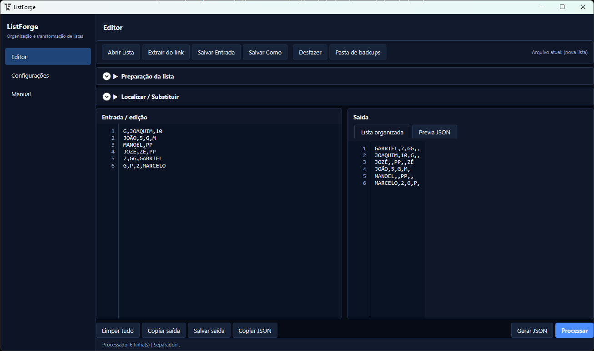
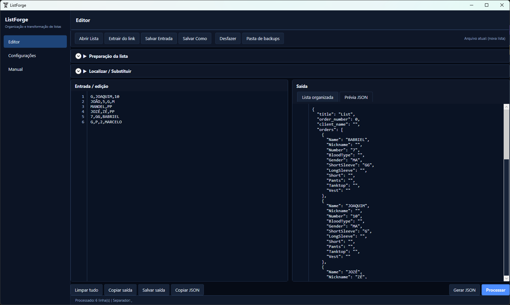
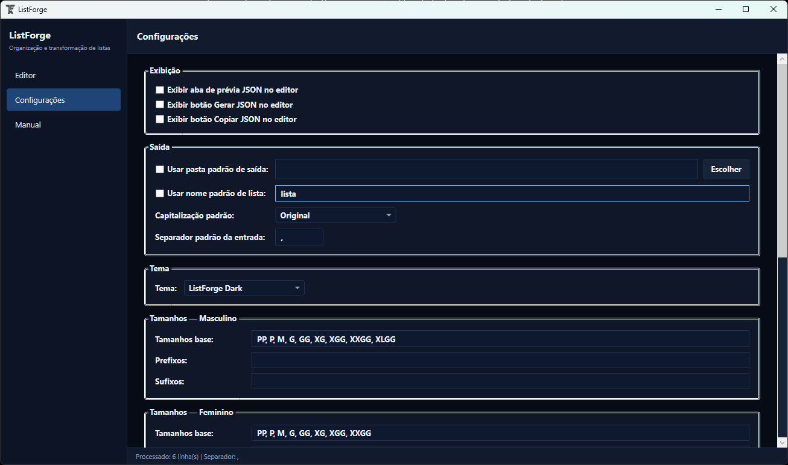
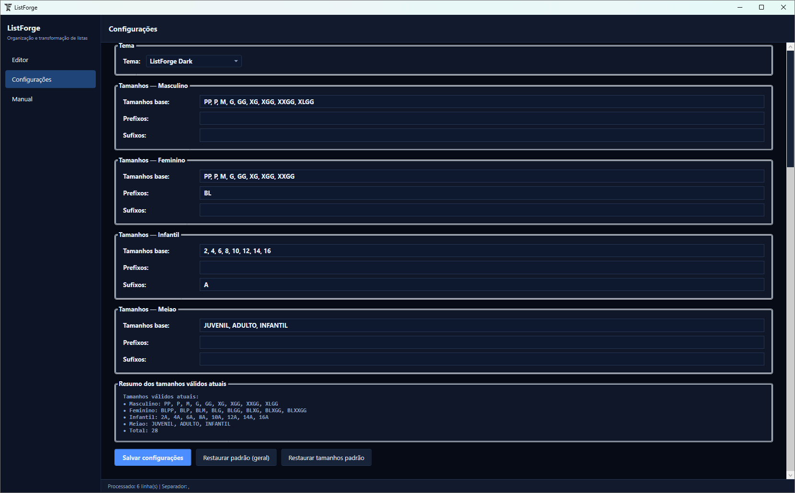

# ListForge

**ListForge** é uma aplicação desktop para Windows, desenvolvida em **C#**, **.NET 8** e **WPF**, voltada para edição, padronização, organização e exportação de listas de produção.

O projeto foi criado para reduzir retrabalho em operações que recebem listas em formatos variados, com nomes, números, tamanhos e informações extras fora de padrão. A aplicação centraliza a preparação de listas, valida tamanhos configuráveis, organiza a saída textual e gera uma estrutura JSON pronta para integração com outros fluxos.


[](https://github.com/NeuberJone/ListForge/actions/workflows/ci.yml)

---

## Em resumo

* Transforma listas despadronizadas em saídas organizadas e previsíveis.
* Interpreta nomes, números, tamanhos e campos auxiliares.
* Valida tamanhos configuráveis por grupos.
* Expande quantidades por tamanho, como `2-G` ou `3-M`.
* Importa conteúdo de texto, planilhas, PDFs, documentos, imagens e links JSON.
* Gera saída textual e prévia JSON.
* Mantém configurações por usuário e backups automáticos.
* Possui versão completa e build Trial com limite de processamentos.
* Inclui testes automatizados e testes de integração para proteger regras críticas do núcleo e do fluxo principal.
* Registra logs internos diários para suporte e diagnóstico.
* Possui tela Sobre com versão, edição, caminhos e informações de suporte.

## Público-alvo

O ListForge foi pensado para fluxos de produção que recebem listas de nomes, números, tamanhos e informações auxiliares em formatos variados, especialmente em operações de uniformes, sublimação, personalização, preparação de pedidos e ambientes onde listas precisam ser revisadas antes de seguir para produção.

O projeto também serve como demonstração técnica de uma aplicação desktop real, com interface WPF, arquitetura organizada, persistência de configurações, importação de múltiplos formatos, OCR, geração de JSON, instalador e controle de versão.

## Screenshots

As imagens abaixo demonstram o fluxo principal do ListForge.

### Editor principal

Entrada da lista, saída processada e visão geral da aplicação.



### Processamento com JSON

Resultado textual e prévia JSON gerada.



### Configurações

Separador padrão, tema, opções de JSON, pasta de saída e preferências de exibição.



### Grupos de tamanho

Configuração de tamanhos masculinos, femininos, infantis e meião.



## Visão geral

O ListForge trabalha como uma estação de preparação de listas. O usuário pode colar dados manualmente, abrir arquivos, extrair conteúdo de documentos, reconhecer texto em imagens por OCR, limpar separadores, processar os registros e salvar o resultado.

A interface é organizada em áreas de entrada, saída, prévia JSON, configurações e manual. As preferências do usuário são persistidas localmente e incluem separador padrão, modo de capitalização, pasta de saída, nome padrão da lista, tema visual, tamanho da fonte dos editores e grupos de tamanho.

## Problema que o projeto resolve

Listas de produção costumam chegar por mensagens, planilhas, PDFs, documentos, imagens ou links de pedidos. Esses dados frequentemente precisam ser revisados antes de seguir para produção: nomes podem vir fora de ordem, tamanhos podem aparecer em formatos diferentes, quantidades podem estar misturadas com tamanhos e campos extras podem precisar acompanhar a linha final.

O ListForge resolve esse processo com uma ferramenta única para:

* padronizar linhas de entrada;
* validar tamanhos reconhecidos;
* separar nome, número, tamanhos e campos auxiliares;
* expandir quantidades por tamanho;
* preservar ou organizar a saída conforme o fluxo de produção;
* gerar texto e JSON;
* manter backups de arquivos sobrescritos;
* reduzir retrabalho manual na preparação das listas.

## Principais recursos

### Edição e preparação

* Editor de entrada com numeração de linhas.
* Painéis separados para entrada, saída e JSON.
* Abertura e salvamento de arquivos de texto.
* Busca, substituição e destaque de ocorrências.
* Limpeza de espaços ao redor do separador.
* Capitalização em modo original, maiúsculo ou minúsculo.
* Tamanho de fonte ajustável para entrada, saída e prévia JSON.
* Atalho com `Ctrl` + scroll do mouse para aumentar ou diminuir a fonte dos editores.

### Processamento

* Processamento com separador configurável.
* Pré-validação visual da entrada antes do processamento.
* Ordenação opcional da lista processada em modo Original, Crescente ou Decrescente.
* Validação de tamanhos por grupos configuráveis.
* Expansão de quantidades por tamanho.
* Aplicação em lote de tamanho e meião.
* Interpretação de até dois campos extras, como apelido e tipo sanguíneo.
* Preservação da ordem original de entrada.

### Exportação e segurança

* Geração de saída textual.
* Geração, cópia e prévia de JSON.
* Backups automáticos ao sobrescrever arquivos.
* Logs internos diários para diagnóstico técnico.
* Configurações persistentes por usuário.
* Temas visuais selecionáveis.
* Versão Trial com limite de processamentos concluídos com sucesso.

## Importação de arquivos

O núcleo de leitura de arquivos está em `Core/FileImporter.cs`. Os formatos reconhecidos pelo projeto são:

| Tipo          | Extensões                                                 |
| ------------- | --------------------------------------------------------- |
| Texto         | `.txt`, `.csv`                                            |
| PDF           | `.pdf`                                                    |
| Word          | `.docx`, `.doc`                                           |
| Excel         | `.xlsx`, `.xlsm`, `.xls`                                  |
| Imagens       | `.png`, `.jpg`, `.jpeg`, `.bmp`, `.tif`, `.tiff`, `.webp` |
| JSON por link | URLs `http://` ou `https://`                              |

Arquivos de texto são lidos com tentativas de codificação em UTF-8 com BOM, UTF-8, Windows-1252 e ISO-8859-1. PDFs são lidos com PdfPig. Documentos Word usam DocumentFormat.OpenXml. Planilhas usam ClosedXML.

## OCR para imagens

O OCR é feito com Tesseract em português e inglês (`por+eng`). A aplicação tenta reconhecer texto por linha de comando quando encontra `tesseract.exe` e usa o wrapper C# do Tesseract como alternativa interna.

O reconhecimento procura o Tesseract nesta ordem:

1. caminho definido na variável de ambiente `TESSERACT_CMD`;
2. pasta `tesseract` junto ao executável da aplicação;
3. instalações do sistema em `C:\Program Files\Tesseract-OCR` ou `C:\Program Files (x86)\Tesseract-OCR`.

A pasta `tesseract/tessdata` deve acompanhar builds distribuídos quando o reconhecimento por OCR for necessário.

## Processamento de listas

O processamento principal é exposto por `Core/ListProcessor.cs`, que funciona como fachada de compatibilidade para o restante da aplicação. A lógica interna fica separada em arquivos menores: `ListParser.cs`, `ListOutputBuilder.cs`, `JsonOrderBuilder.cs`, `JsonListImporter.cs` e `FileNameHelper.cs`.

Cada linha é interpretada em partes separadas pelo separador ativo. O algoritmo identifica:

* nome;
* número;
* um ou mais tamanhos;
* até dois campos extras: apelido e tipo sanguíneo;
* tamanhos com quantidade no formato `2-G`, `3-M` ou equivalente válido.

Após a leitura, as linhas mantêm a mesma ordem da entrada. A saída textual distribui os tamanhos por grupos reconhecidos, preserva colunas vazias internas quando necessário, compacta colunas finais antes dos campos extras e formata esses campos no final como apelido seguido de tipo sanguíneo quando esse terceiro campo existir.

Por padrão, o ListForge preserva a ordem original da lista informada. Caso uma ordenação adicional seja implementada ou habilitada no fluxo, ela deve ser tratada como uma opção explícita do usuário, sem alterar a responsabilidade principal do processamento: interpretar corretamente a entrada.

## Ordenação da lista

No painel Preparação da lista, a opção Ordenação controla a ordem usada depois da leitura da entrada e antes da montagem da Lista organizada e do JSON.

Opções disponíveis:

* Original: mantém a ordem digitada ou importada. É o padrão ao abrir o app.
* Crescente: ordena por nome de A-Z e, em nomes iguais, por número crescente.
* Decrescente: ordena por nome de Z-A e, em nomes iguais, por número decrescente.

Quando o número pode ser lido como valor numérico, a comparação é numérica. Assim, `2` vem antes de `10` no modo Crescente. Se o número não for numérico, o ListForge usa comparação textual como alternativa. A ordenação escolhida afeta a saída textual e a prévia/geração de JSON.

## Pré-validação da entrada

Antes de processar a lista, o ListForge faz uma pré-validação das linhas preenchidas. Quando encontra problemas, o processamento é interrompido e a aplicação mostra um resumo como:

```text
Linha 7: tamanho não reconhecido
Linha 12: sem tamanho
Linha 18: mais de 6 tamanhos
```

As linhas apontadas ficam destacadas na numeração da entrada para facilitar a revisão. Erros de pré-validação não consomem crédito da versão Trial, porque o processamento final não é executado.

## Suporte a quantidades por tamanho

Tamanhos podem vir com quantidade usando o formato `quantidade-tamanho`.

Exemplo:

```text
ANA,10,2-G
BRUNO,7,M
CARLA,12,3-BLP
```

No processamento, quantidades maiores que uma unidade são expandidas em linhas equivalentes para a saída e para o JSON.

## Versão Trial

A build Trial é gerada separadamente da versão completa e aparece como `ListForge Trial` no título/interface e no nome do executável.

O Trial possui limite de processamentos de listas. Cada processamento concluído com sucesso consome 1 crédito. Erro de entrada, validação inválida, falha antes do processamento final ou cancelamento do usuário não consomem crédito.

A versão completa não consome créditos e não depende do controle Trial. O limite padrão do Trial é 10 processamentos e pode ser ajustado pela variável de ambiente `LISTFORGE_TRIAL_PROCESSING_LIMIT`.

O armazenamento interno de estado da versão Trial foi aprimorado para separar dados internos dos arquivos de configuração exibidos ao usuário.

## Grupos de tamanho configuráveis

Os tamanhos ficam em `sizes.json` e são representados por `Models/SizeConfig.cs`. O padrão do sistema inclui quatro grupos:

| Grupo     | Uso                                                |
| --------- | -------------------------------------------------- |
| Masculino | tamanhos base como `PP`, `P`, `M`, `G`, `GG`, `XG` |
| Feminino  | tamanhos base combinados com prefixos, como `BLP`  |
| Infantil  | tamanhos numéricos e sufixos, como `8A`            |
| Meião     | opções como `JUVENIL`, `ADULTO` e `INFANTIL`       |

Cada grupo permite configurar tamanhos base, prefixos e sufixos. O índice final de tamanhos é montado em `Core/SizeHelper.cs`.

## Separadores personalizados

O separador padrão é vírgula, mas pode ser alterado no editor ou nas configurações para outro caractere simples usado no fluxo da lista.

O mesmo separador é usado para limpar espaços, interpretar a entrada e montar a saída textual.

## Testes automatizados

O projeto de testes fica em `ListForge.Tests` e cobre partes rápidas e determinísticas do núcleo, sem depender de OCR. A suíte valida cenários de processamento, tamanhos, quantidade por tamanho, campos extras, meião, JSON, erros de entrada e leitura/escrita de texto simples.

Para rodar os testes na raiz do projeto:

```powershell
dotnet test
```

## Logs internos

O ListForge cria logs diários para ajudar no suporte e diagnóstico de erros em versões distribuídas. Os arquivos ficam em:

```text
%APPDATA%\ListForge\logs
```

Na prática, a aplicação usa o diretório gravável resolvido por `ConfigManager.AppDir` e cria a subpasta `logs`. O nome do arquivo segue o padrão:

```text
listforge-YYYY-MM-DD.log
```

Os logs registram falhas técnicas de importação de arquivos, OCR, salvamento de configurações, processamento de listas, consumo/bloqueio Trial e exceções inesperadas da aplicação. As entradas incluem data/hora, nível, versão, edição, contexto, mensagem, exceção e stack trace quando houver.

Por padrão, o conteúdo completo das listas processadas não é registrado. Caminhos de arquivos podem aparecer no log quando ajudam no diagnóstico. A tela Configurações possui o botão **Abrir pasta de logs**.

## Tela Sobre

A tela Sobre exibe informações úteis para identificação da instalação e suporte:

* produto e versão atual, obtida da metadata do assembly;
* edição Completo ou Trial;
* status da versão Trial, com créditos restantes e limite de processamentos quando aplicável;
* campo Licenciado para, preparado para uso futuro;
* autor e contato;
* pasta de configuração e pasta de logs usadas pelo aplicativo;
* resumo curto de licença/propriedade.

Ela também possui ações para copiar as informações do produto para suporte, gerar pacote de suporte, abrir a pasta de configuração e abrir a pasta de logs.

## Pacote de suporte

A tela Sobre possui a ação **Gerar pacote de suporte**, que cria um arquivo `.zip` para diagnóstico técnico.

O pacote inclui informações do produto, resumo seguro de configurações, tamanhos configurados e logs recentes. Ele não inclui conteúdo completo da entrada, saída organizada, JSON de listas reais, arquivos de listas do usuário nem estado interno do Trial.

Ao gerar o pacote, escolha a pasta de destino. Antes de enviar o arquivo para suporte, revise o ZIP se houver informações sensíveis nos logs, como caminhos de arquivos locais.

## Tamanho da fonte dos editores

O tamanho da fonte dos editores de Entrada / edição, Saída e Prévia JSON pode ser ajustado nas Configurações, na seção Exibição.

Também é possível alterar rapidamente pelo editor: posicione o mouse sobre a entrada ou saída, segure `Ctrl` e role o scroll do mouse. `Ctrl` + scroll para cima aumenta a fonte; `Ctrl` + scroll para baixo diminui. O valor é aplicado aos três editores ao mesmo tempo, respeita o intervalo de 8 a 32 px e é salvo em `config.json`.

## Geração de JSON

O ListForge gera uma prévia JSON com o objeto `orders`. A estrutura inclui campos como:

* `Name`;
* `Nickname`;
* `Number`;
* `BloodType`;
* `Gender`;
* `ShortSleeve`;
* `LongSleeve`;
* `Short`;
* `Pants`;
* `Tanktop`;
* `Vest`.

O meião é mantido na lista organizada, mas não é exportado como campo `Socks` no JSON.

O JSON é encapsulado com metadados básicos como `title`, `order_number`, `client_name`, `unique_name_chars` e `unique_nickname_chars`.

## Backups automáticos

Antes de sobrescrever um arquivo existente, a aplicação cria uma cópia na pasta de backups. O nome do backup usa o nome do arquivo original e um carimbo de data e hora.

Exemplo:

```text
lista_20260525_143012.txt
```

Os backups ficam no diretório configurado por `ConfigManager.BackupDir`.

## Temas visuais

O ListForge possui três temas:

| Tema            | Arquivo                       |
| --------------- | ----------------------------- |
| ListForge Dark  | `UI/Themes/DarkTheme.xaml`    |
| ListForge Light | `UI/Themes/LightTheme.xaml`   |
| SISBolt         | `UI/Themes/SisBoltTheme.xaml` |

Os temas são carregados por `ResourceDictionary` e aplicados pela janela principal em tempo de execução.

## Estrutura do projeto

```text
ListForge/
├─ App.xaml
├─ App.xaml.cs
├─ GlobalUsings.cs
├─ ListForge.csproj
├─ ListForge.slnx
├─ README.md
├─ LICENSE.md
├─ CHANGELOG.md
├─ Assets/
│  └─ logo.ico
├─ Config/
│  └─ ConfigManager.cs
├─ Core/
│  ├─ AppLogger.cs
│  ├─ FileImporter.cs
│  ├─ FileNameHelper.cs
│  ├─ JsonListImporter.cs
│  ├─ JsonOrderBuilder.cs
│  ├─ ListOutputBuilder.cs
│  ├─ ListParser.cs
│  ├─ ListProcessor.cs
│  ├─ OperationResult.cs
│  ├─ SizeHelper.cs
│  └─ TrialManager.cs
├─ Models/
│  ├─ AppConfig.cs
│  ├─ ParsedRow.cs
│  └─ SizeConfig.cs
├─ Services/
│  ├─ AboutService.cs
│  ├─ FileImportService.cs
│  ├─ FolderService.cs
│  ├─ OutputExportService.cs
│  ├─ ProcessingWorkflowService.cs
│  └─ SupportPackageService.cs
├─ ListForge.Tests/
│  ├─ FileImporterTests.cs
│  ├─ FileImportServiceTests.cs
│  ├─ AppLoggerTests.cs
│  ├─ ListForge.Tests.csproj
│  ├─ ListProcessorTests.cs
│  ├─ OperationResultTests.cs
│  ├─ OutputExportServiceTests.cs
│  ├─ SupportPackageServiceTests.cs
│  ├─ TextSearchHelperTests.cs
│  └─ SizeHelperTests.cs
├─ ViewModels/
│  ├─ MainViewModel.cs
│  └─ RelayCommand.cs
├─ UI/
│  ├─ Controls/
│  │  ├─ LineNumberedTextBox.cs
│  │  ├─ SegmentedControl.cs
│  │  └─ SegmentedControl.xaml
│  ├─ Themes/
│  │  ├─ DarkTheme.xaml
│  │  ├─ LightTheme.xaml
│  │  └─ SisBoltTheme.xaml
│  └─ Views/
│     ├─ EditorView.xaml
│     ├─ EditorView.xaml.cs
│     ├─ InputDialog.xaml.cs
│     ├─ MainWindow.xaml
│     ├─ MainWindow.xaml.cs
│     ├─ ManualView.xaml
│     ├─ ManualView.xaml.cs
│     ├─ SettingsView.xaml
│     └─ SettingsView.xaml.cs
├─ installer/
│  └─ ListForge.iss
└─ tesseract/
   ├─ tesseract.exe
   ├─ tessdata/
   │  ├─ eng.traineddata
   │  ├─ osd.traineddata
   │  └─ por.traineddata
   └─ bibliotecas nativas do Tesseract
```

## Arquitetura

O projeto segue uma organização simples baseada em WPF e MVVM:

* `App.xaml` inicia a aplicação e declara recursos globais.
* `UI/Views` contém janelas e telas.
* `UI/Controls` contém controles reutilizáveis.
* `UI/Themes` contém os dicionários de estilo.
* `ViewModels/MainViewModel.cs` coordena estado, comandos e integração entre UI, configuração e processamento.
* `Services` contém serviços pequenos usados pela UI, como informações da tela Sobre e abertura de pastas.
* `Core/FileImporter.cs` concentra leitura de arquivos, OCR e normalização de textos importados.
* `Core/OperationResult.cs` padroniza retornos de operações internas, separando mensagem ao usuário, detalhe técnico, exceção e código de erro.
* `Services/FileImportService.cs`, `Services/OutputExportService.cs` e `Services/SupportPackageService.cs` retornam resultados padronizados para facilitar testes, mensagens amigáveis e logging técnico.
* `Core/AppLogger.cs` registra logs internos diários para suporte e diagnóstico.
* `Core/ListProcessor.cs` funciona como fachada de compatibilidade para as chamadas públicas de processamento.
* `Core/ListParser.cs` concentra separadores, limpeza por separador, parsing de linha e preservação da ordem de entrada.
* `Core/ListOutputBuilder.cs` concentra a explosão de tamanhos, distribuição de grupos, meião e montagem da saída textual.
* `Core/JsonOrderBuilder.cs` concentra a montagem de `orders`, prévia JSON e exportação JSON.
* `Core/JsonListImporter.cs` concentra a extração de lista textual a partir de JSON.
* `Core/FileNameHelper.cs` concentra sanitização de nomes e caminhos versionados.
* `Core/SizeHelper.cs` concentra validação e montagem dos grupos de tamanho.
* `Core/TextSearchHelper.cs` concentra busca e substituição de texto usada pelo editor.
* `Core/TrialManager.cs` concentra o controle de créditos da versão Trial.
* `Config/ConfigManager.cs` gerencia configurações, tamanhos, backups e caminhos graváveis.
* `Models` contém os objetos de configuração e linhas processadas.
* `ListForge.Tests` contém testes automatizados do núcleo determinístico.

## Decisões técnicas

* **WPF** foi escolhido para entregar uma aplicação desktop nativa para Windows.
* **MVVM** organiza a separação entre interface, estado e comandos.
* A API pública de processamento é mantida em `Core/ListProcessor.cs`, enquanto as responsabilidades internas são separadas por área para reduzir acoplamento e facilitar testes.
* A leitura de arquivos e OCR foi separada em `Core/FileImporter.cs`, reduzindo acoplamento com a tela principal.
* As configurações são salvas em uma pasta gravável por usuário, evitando depender da pasta do executável.
* Os tamanhos são configuráveis via `sizes.json`, permitindo adaptação a diferentes padrões de produção.
* O controle Trial foi isolado em `Core/TrialManager.cs`, para separar a regra comercial do restante do processamento.
* O editor com numeração de linhas foi implementado como controle reutilizável em `UI/Controls/LineNumberedTextBox.cs`.
* O logging interno usa arquivos locais diários, sem dependências externas, e falhas ao escrever logs são ignoradas de forma segura.

## Dados de configuração

As configurações são salvas em uma pasta gravável por usuário. A aplicação tenta usar os seguintes locais, nessa ordem:

1. `%APPDATA%\ListForge`
2. pasta de dados de aplicativo do usuário
3. `%LOCALAPPDATA%\ListForge`
4. pasta base da aplicação
5. pasta atual do processo
6. pasta temporária do Windows

Arquivos principais:

| Arquivo ou pasta   | Função                                      |
| ------------------ | ------------------------------------------- |
| `config.json`      | preferências gerais da aplicação            |
| `sizes.json`       | grupos de tamanho válidos                   |
| `backups/`         | cópias automáticas de arquivos sobrescritos |
| `logs/`            | logs internos diários para diagnóstico      |

## Tesseract OCR

O projeto inclui binários do Tesseract na pasta `tesseract`. O arquivo `ListForge.csproj` marca esse conteúdo como `Content` com `CopyToOutputDirectory` em modo `PreserveNewest`, garantindo que os dados necessários ao OCR sejam copiados para a saída de build.

Idiomas incluídos em `tesseract/tessdata`:

* `por.traineddata`;
* `eng.traineddata`;
* `osd.traineddata`.

## Pré-requisitos para desenvolvimento

| Ferramenta          | Recomendação                            |
| ------------------- | --------------------------------------- |
| Sistema operacional | Windows 10 ou Windows 11 x64            |
| .NET SDK            | 8.0 ou superior                         |
| IDE                 | Visual Studio 2022 ou editor compatível |
| Inno Setup          | 6.x ou 7.x para gerar instalador        |

## Como executar em desenvolvimento

Na raiz do projeto:

```powershell
dotnet restore
dotnet build
dotnet run
```

Executável gerado em Debug:

```text
bin\Debug\net8.0-windows\ListForge.exe
```

## Build e distribuição

O projeto está configurado para Windows x64 e versão `2.1.22`.

### Script de release

Para reduzir inconsistências entre versão do projeto, instalador, documentação e artefatos finais, use o script de release na raiz do repositório:

```powershell
.\build-release.ps1 -Version 2.1.16
```

O script:

* atualiza versões em `ListForge.csproj`, `installer/ListForge.iss` e trechos de build/distribuição do `README.md`;
* roda `dotnet restore`, `dotnet build`, `dotnet test` e `dotnet build -c Release`;
* publica a versão instalável;
* publica o onefile oficial/completo;
* publica o onefile Trial;
* gera o instalador com Inno Setup;
* gera `SHA256SUMS.txt` com os hashes dos artefatos principais;
* coloca todos os artefatos em `bin\Release\dist\X.Y.Z`.

Por padrão, o script não sobrescreve uma pasta de versão já existente. Para recriar somente a pasta da versão atual, use `-Force`. Ele nunca apaga o `dist` inteiro nem pastas de versões anteriores.

Se o Inno Setup não estiver em um caminho comum, informe o compilador manualmente:

```powershell
.\build-release.ps1 -Version 2.1.16 -InnoSetupPath "C:\Program Files\Inno Setup 7\ISCC.exe"
```

### Comandos manuais

Publicação instalável:

```powershell
dotnet publish -c Release -r win-x64 --self-contained true -p:DebugType=None -p:DebugSymbols=false -o bin\Release\dist\2.1.23\ListForge-Installable
```

Publicação em arquivo único:

```powershell
dotnet publish -c Release -r win-x64 --self-contained true -p:PublishSingleFile=true -p:IncludeAllContentForSelfExtract=true -p:DebugType=None -p:DebugSymbols=false -o bin\Release\dist\2.1.23\ListForge-Portable-OneFile
```

Publicação Trial em arquivo único:

```powershell
dotnet publish -c Release -r win-x64 --self-contained true -p:PublishSingleFile=true -p:IncludeAllContentForSelfExtract=true -p:DefineConstants=TRIAL_BUILD -p:DebugType=None -p:DebugSymbols=false -o bin\Release\dist\2.1.23\ListForge-Trial-OneFile
```

Instalador:

```text
installer\ListForge.iss
```

O script do Inno Setup usa a saída `bin\Release\dist\2.1.23\ListForge-Installable` e gera o instalador em:

```text
bin\Release\dist\2.1.23\Installer
```

Após confirmar os artefatos obrigatórios, o script gera:

```text
bin\Release\dist\2.1.23\SHA256SUMS.txt
```

Esse arquivo lista os checksums SHA256 dos executáveis principais usando caminhos relativos à pasta da versão.

## Publicação de release no GitHub

Antes de publicar uma release no GitHub, gere e confira a distribuição local:

```powershell
.\build-release.ps1 -Version X.Y.Z
```

Depois confira os artefatos em `bin\Release\dist\X.Y.Z`, incluindo o instalador, os dois onefiles e `SHA256SUMS.txt`.

O fluxo recomendado é:

```powershell
git tag vX.Y.Z
git push origin vX.Y.Z
```

Em seguida, crie a release no GitHub usando a tag `vX.Y.Z`, revise as notas com base na seção correspondente do `CHANGELOG.md` e anexe:

* `ListForge-Portable-OneFile\ListForge-vX.Y.Z.exe`;
* `ListForge-Trial-OneFile\ListForge-Trial-vX.Y.Z.exe`;
* `Installer\ListForge-Setup-X.Y.Z.exe`;
* `SHA256SUMS.txt`.

O script auxiliar abaixo valida os artefatos locais, prepara notas a partir do changelog e mostra os comandos de publicação sem criar uma release automaticamente:

```powershell
.\create-github-release.ps1 -Version X.Y.Z
```

Para publicar usando GitHub CLI, revise os dados exibidos, confirme que a tag já existe e execute explicitamente:

```powershell
.\create-github-release.ps1 -Version X.Y.Z -Create
```

O script não armazena tokens nem credenciais. Se usar `gh`, ele depende apenas da autenticação local já configurada.

## Dependências principais

| Dependência            | Uso                                  |
| ---------------------- | ------------------------------------ |
| Newtonsoft.Json        | leitura e geração de JSON            |
| Tesseract              | OCR de imagens                       |
| PdfPig                 | extração de texto de PDFs            |
| DocumentFormat.OpenXml | extração de texto de documentos Word |
| ClosedXML              | extração de texto de planilhas Excel |
| Inno Setup             | geração do instalador Windows        |

## Fluxo básico de uso

1. Abra o ListForge.
2. Cole uma lista ou abra um arquivo compatível.
3. Ajuste o separador de entrada quando necessário.
4. Use a limpeza de espaços para padronizar a entrada.
5. Aplique tamanho ou meião em lote, se necessário.
6. Clique em processar.
7. Revise a saída textual.
8. Gere ou copie o JSON quando a área estiver habilitada.
9. Salve a saída no local desejado.

## Exemplos de entrada e saída

Entrada simples:

```text
JOAO,10,G
MARIA,2,M
PEDRO,8,2-P
ANA,14,BLG
```

Saída textual com separador vírgula:

```text
JOAO,10,G
MARIA,2,M
PEDRO,8,P
PEDRO,8,P
ANA,14,BLG
```

Prévia JSON simplificada:

```json
{
  "title": "List",
  "order_number": 0,
  "client_name": "",
  "orders": [
    {
      "Name": "ANA",
      "Nickname": "",
      "Number": "14",
      "BloodType": "",
      "Gender": "FE",
      "ShortSleeve": "BLG",
      "LongSleeve": "",
      "Short": "",
      "Pants": "",
      "Tanktop": "",
      "Vest": ""
    }
  ],
  "unique_name_chars": "",
  "unique_nickname_chars": ""
}
```

## Boas práticas

* Revise os grupos de tamanho antes de processar listas com novos padrões.
* Use separadores consistentes na entrada.
* Prefira uma linha por pessoa ou item de produção.
* Use o formato `quantidade-tamanho` para quantidades repetidas.
* Mantenha a pasta `tesseract/tessdata` junto ao executável quando OCR for necessário.
* Gere uma saída nova em vez de sobrescrever arquivos sem revisar o backup.
* Atualize a versão em `ListForge.csproj` e `installer/ListForge.iss` antes de distribuir uma nova build.
* Não versione `bin/`, `obj/`, `.vs/`, instaladores gerados ou arquivos temporários.

## Roadmap

* Logs internos para erros de leitura e OCR.
* Prévia visual mais detalhada do JSON.
* Modelos configuráveis de exportação.
* Validações adicionais para arquivos de entrada.
* Ferramenta de diagnóstico para Tesseract.

## Changelog

As alterações relevantes por versão são documentadas em `CHANGELOG.md`.

## Licença

O ListForge é um software proprietário desenvolvido por Neuber Jone.

Este repositório é disponibilizado publicamente apenas para fins de portfólio, avaliação técnica e demonstração. O acesso ao código-fonte não concede permissão para uso comercial, uso interno em empresas, cópia, modificação, redistribuição, revenda, hospedagem, criação de derivados ou exploração comercial do software.

O uso comercial, implantação privada, distribuição de executáveis, licenciamento mensal, suporte, manutenção ou customização do ListForge dependem de autorização prévia e de uma licença ou contrato comercial específico.

A aquisição de uma licença comercial não transfere a propriedade intelectual, o código-fonte, a marca, a identidade visual ou os direitos de exploração comercial do software, salvo acordo escrito em sentido contrário.

Consulte também o arquivo `LICENSE.md`.

## Autor

Desenvolvido por **Neuber Jone**.

## Status

Produto desktop em desenvolvimento ativo, mantido como aplicação Windows para preparação, padronização e exportação de listas de produção.
